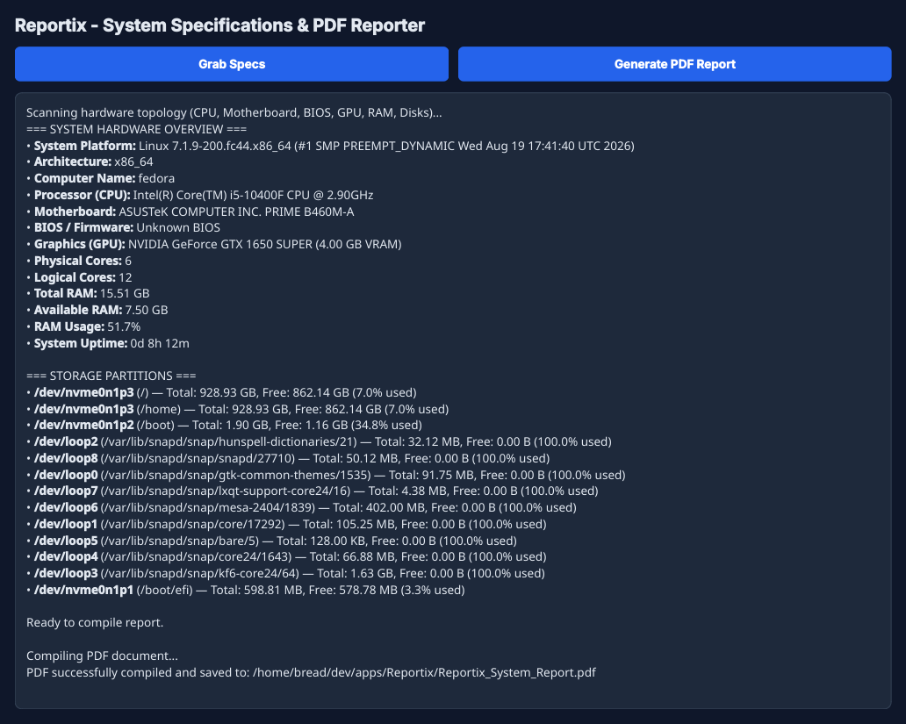
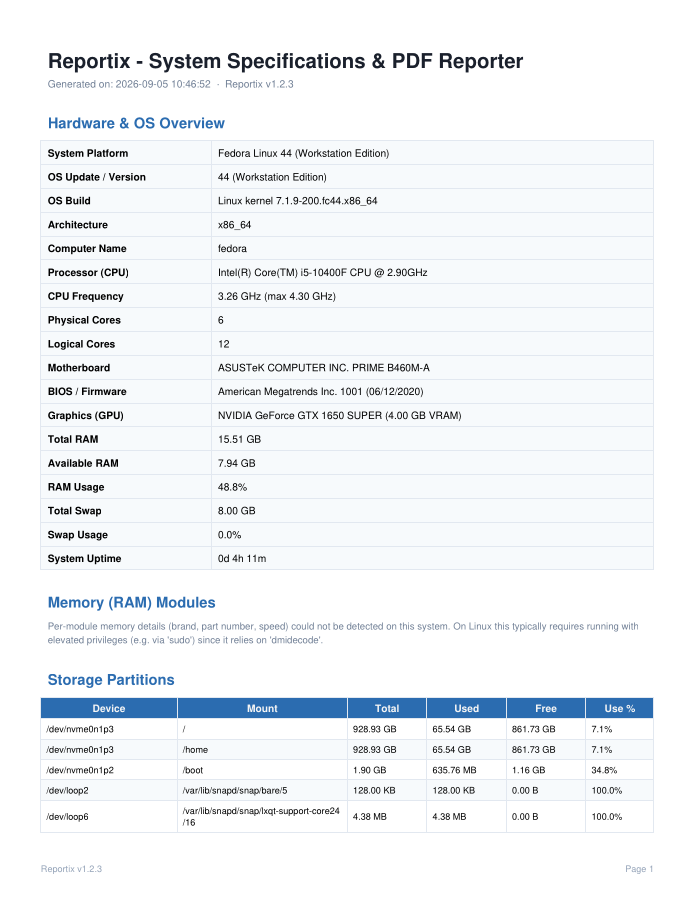

# Reportix

An effortless way to generate a clean, detailed PDF report of your computer's hardware and system specifications.

> The app is only tested on Linux and Windows

## What's new in 1.2.0

- **Fixed RAM module count.** Some systems (mostly via a known WMI/dmidecode quirk) reported the same physical stick twice. Reportix now de-duplicates modules so the count matches what's actually installed.
- **Edit → Preferences.** Choose a Theme (System / Light / Dark) and a Language. Preferences are saved and applied immediately, no restart needed.
- **Languages:** English, العربية, 日本語, Deutsch, Русский, Español, Français, 中文（简体）, Português, Türkçe, 한국어, हिन्दी. All non-English UI text was translated using AI and may not be fully accurate — if you spot an error, please [open an issue](https://github.com/Abdulaziz-hu/Reportix/issues/new/choose) or send a fix.
- The app now remembers its window size/position between launches.

## Screenshots

| App Interface  | PDF Report |
| :---: | :---: |
|  |  |

**Prerequisites**
Python 3.8 or higher installed on your system.

**Installation**
Open a terminal in the project directory and run the following commands to create a virtual environment and install the required dependencies.

```bash
python -m venv venv
venv\Scripts\activate     # Linux: source venv/bin/activate 
pip install -r requirements.txt
```

**Usage**
Start the application by running the main script.

```bash
python main.py
```

**Building the Application**
To package the project into a standalone executable file, you can use PyInstaller.

Install PyInstaller in your active virtual environment:

```bash
pip install pyinstaller
```

Run the build command from the project root directory:

```bash
pyinstaller --onefile --noconsole --name "Reportix-v1.2.1-portable" main.py
```

The compiled standalone executable will be created inside the `dist` folder.

## License

This project is under the MIT license. Read the [License](LICENSE.md) document for more details.

## Contributors

<a href="https://github.com/Abdulaziz-hu/Reportix/graphs/contributors">
  
</a>